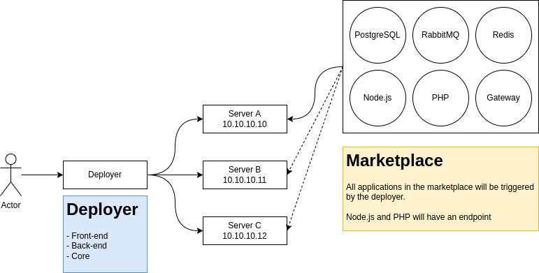

# CloudBoz CLI

Agent-less cloud server management panel

## Features

### Commons

- [] Docker Engine
- [] Docker Limit Logs
- [] Docker System Prune
- [] Docker Swarm
- [] Docker Swarm Network
- [] Docker Container Scale
- [] Kong API Gateway
- [] Portainer

### Security

- [] Firewall
- [] Let's Encrypt

### Marketplace

#### CMS

- [] WordPress
- [] Drupal
- [] Joomla
- [] Magento

#### Database

- [] MySQL
- [] MariaDB
- [] PostgreSQL
- [] MongoDB
- [] Cassandra

#### Cache

- [] Redis
- [] Memcached

#### CI/CD

- [] GitHub Runner
- [] GitLab Runner
- [] Bitbucket Runner
- [] Jenkins

#### Git

- [] GitLab
- [] Gitea
- [] Gogs

#### Storage

- [] NextCloud
- [] OwnCloud
- [] MinIO
- [] LakeFS
- [] JuiceFS
- [] GlusterFS

#### Monitoring

- [] Grafana
- [] Prometheus
- [] Node Exporter

#### Streaming

- [] Apache Kafka
- [] RabbitMQ

# Architecture



# Requirements

- Ubuntu >= 18.04
- Ansible

# How to install?

- Make sure you use Ubuntu Server 20.04
- Clone this repository to `/home/$USER/`
- Install Ansible on the server

```
sudo apt update
sudo apt install software-properties-common
sudo add-apt-repository --yes --update ppa:ansible/ansible
sudo apt install ansible
```

- Go to `/home/$USER/cloudboz-cli` then run:

```
ansible-galaxy install community.docker
```

# Codebase structure

```
cloudboz-cli/                            # The project's root directory
├───clouds/                              # Directory of system optimization
├───files/                               # Directory of system optimization
│   ├───sysctl.conf                      # Kernel optimization
│   └───ulimit.conf                      # Ulimit optimization
├───group_vars/                          # Directory of system optimization
│   ├───all.yml                          # ENV for service
├───roles/                               # Directory of roles processing
│   ├───common/tasks/main.yml            # Tasks to install common
│   └───service/postgres/tasks/main.yml  # Tasks to install service
├───virtual/                             # Directory of secrets
│   ├───env.var                          # ENV Var for login to the server
│   └───ssh.key                          # SSH Key for login to the server
├───ansible.cfg                          # Ansible config
├───ansible.host                         # Ansible target
└───cloudboz.yml                         # CloudBoz
```

# How to setup?

- Open this file `core/secrets/env.var` and change anything you need.
- Copy your ssh private key from server to this file `core/secrets/ssh.key`.
- Run this command `chmod 400 core/secrets/ssh.key`.
- Insert your server IP in this file `core/ansible.host`.

# How to use?

Make sure OS is up-to-date, optimized, and install all dependencies, so run this command:

```
ansible-playbook deployer.yml --tags "install-common"
```

**Postgres**

```
ansible-playbook deployer.yml --tags "create-postgres"
ansible-playbook deployer.yml --tags "info-postgres"
ansible-playbook deployer.yml --tags "destroy-postgres"
```

**RabbitMQ**

```
ansible-playbook deployer.yml --tags "create-rabbitmq"
ansible-playbook deployer.yml --tags "info-rabbitmq"
ansible-playbook deployer.yml --tags "destroy-rabbitmq"
```

**Redis**

```
ansible-playbook deployer.yml --tags "create-redis"
ansible-playbook deployer.yml --tags "info-redis"
ansible-playbook deployer.yml --tags "destroy-redis"
```
